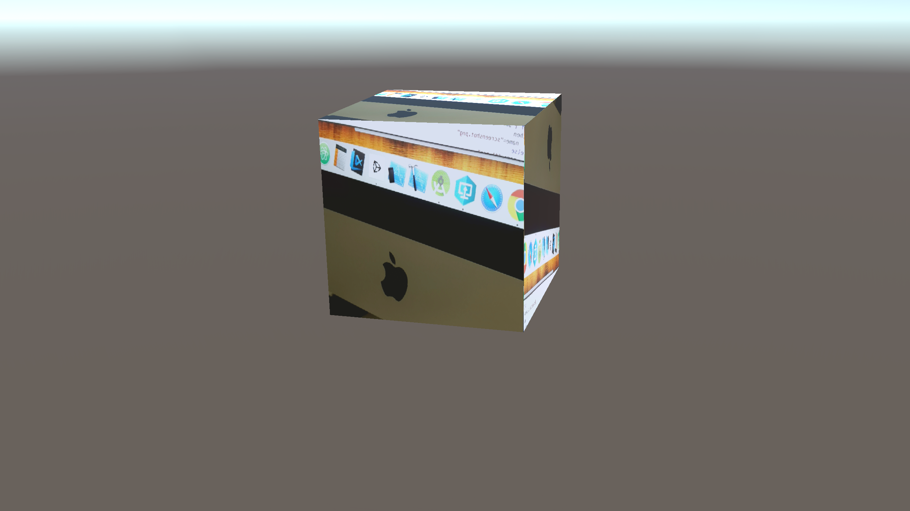

# unity-android-native-camera

On this repository you'll find an experiment to draw the Native Android Camera feed onto a Unity GameObject.

The inspiration comes from [Unity Technologies NativeRenderingPlugin](https://github.com/Unity-Technologies/NativeRenderingPlugin).

The folder structure contains the following code:

[NativeCameraPlugin](NativeCameraPlugin): an NDK library as the low level rendering plugin

[UnityAndroidCameraPlugin](UnityAndroidCameraPlugin): an Android Studio project to create and AAR library as Unity Native Plugin

[UnityAndroidCamera](UnityAndroidCamera): the Unity project that integrates both plugins.

Upon success you'll see something like the below image on your Android device:


## Setup

### 2020
Toolchain:
* Android Studio 4.0.1
* Android SDK 9.0 (API 28) Rev 6
* Android NDK (Side by side) 21.3.6528147
* Unity Hub 2.3.2
* Unity 2020.1.3f1

## Troubleshooting

If you have trouble building the Unity project, please try the following:
```
Open "Build Settings" and make sure that you have switched to the "Android" platform.

This should allow you to build successfully.
```
